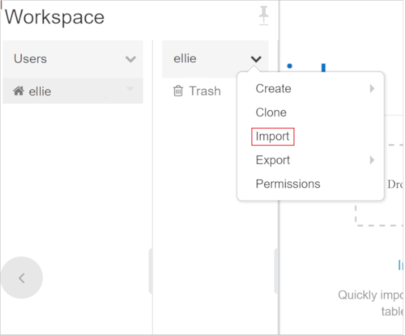
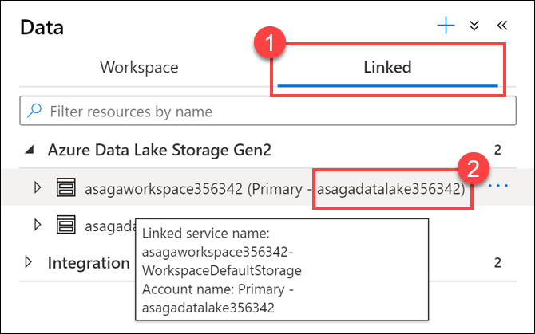

# Módulo 1 - Explore as opções de computação e armazenamento para cargas de trabalho de engenharia de dados

Este módulo ensina maneiras de estruturar o data lake e otimizar os arquivos para exploração, streaming e cargas de trabalho em lote. O aluno aprenderá a organizar o data lake em níveis de refinamento de dados à medida que transforma arquivos por meio de processamento em lote e fluxo. Em seguida, eles aprenderão a criar índices em seus conjuntos de dados, como arquivos CSV, JSON e Parquet, e usá-los para uma possível consulta e aceleração de carga de trabalho.

Neste módulo, o aluno será capaz de:

- Combine streaming e processamento em lote com um único pipeline
- Organize o data lake em níveis de transformação de arquivos
- Indexar armazenamento de data lake para aceleração de consulta e carga de trabalho

## Laboratório 1 - Arquitetura do Data Lake

Neste laboratório, você usará um espaço de trabalho do Azure Databricks e executará o streaming estruturado com trabalhos em lote usando o Data Lake. Você precisa concluir os exercícios em um Databricks Notebook. Para começar, você precisa ter acesso a um espaço de trabalho do Azure Databricks. Se você não tiver um espaço de trabalho disponível, siga as instruções abaixo. Caso contrário, você pode pular para o final da página para [Clone the Databricks archive](#clone-the-databricks-archive).

### Antes do laboratório prático

> **Observação:** conclua apenas as etapas "Antes do laboratório prático" se você **não** estiver usando um ambiente de laboratório hospedado e estiver usando sua própria assinatura do Azure. Caso contrário, pule para o Exercício 1.

Antes de percorrer os exercícios deste laboratório, verifique se você tem acesso a um espaço de trabalho do Azure Databricks com um cluster disponível. Execute as tarefas abaixo para configurar o espaço de trabalho.

#### Tarefa 1: Criar e configurar o espaço de trabalho Azure Databricks

**Se você não estiver usando um ambiente de laboratório hospedado**, siga as [lab 01 setup instructions](https://github.com/solliancenet/microsoft-data-engineering-ilt-deploy/blob/main/setup/01/lab-01-setup.md) para criar e configurar manualmente a área de trabalho.

### Exercício 1: Preencha o Notebook

#### Tarefa 1: Clone o arquivo Databricks

1. Se você não tiver o espaço de trabalho do Azure Databricks aberto no momento: no portal do Azure, navegue até o espaço de trabalho do Azure Databricks implantado e selecione **Launch Workspace**.
2. No painel esquerdo, selecione **Workspace** > **Users** e selecione seu nome de usuário (a entrada com o ícone de casa).
3. No painel exibido, selecione a seta ao lado do seu nome e selecione **Importar**.



1. Na caixa de diálogo **Import Notebooks**, selecione o URL e cole o seguinte URL:
 ```
  https://github.com/solliancenet/microsoft-learning-paths-databricks-notebooks/blob/master/data-engineering/DBC/11-Delta-Lake-Architecture.dbc?raw=true
 ```
2. Selecione **Importar**.
3. Selecione a pasta **11-Delta-Lake-Architecture** que aparece.

#### Tarefa 2: Preencha o seguinte Notbook

Abra o bloco de anotações **1-Delta-Architecture**. Certifique-se de anexar seu notebook antes de seguir as instruções e executar as células dele.

No notebook, você explorará um lote de streaming e processamento em um único pipeline.

> Depois de aprofundar o notebook, a esta tela e continuar para o laboratório.

## Laboratório 2 - Trabalhando com Apache Spark no Synapse Analytics

Este laboratório demonstra a experiência de trabalhar com o Apache Spark no Azure Synapse Analytics. Você aprenderá como conectar um espaço de trabalho do Azure Synapse Analytics a um espaço de trabalho do Azure Data Explorer usando um serviço vinculado e carregar dados de um de seus bancos de dados usando um notebook Spark. Você também aprenderá a usar bibliotecas como Hyperspace e MSSparkUtil para otimizar a experiência de trabalhar com contas de armazenamento Data Lake de notebooks Spark. Além do armazenamento do Data Explorer e do Data Lake, o processo de enriquecimento de dados também usará dados históricos de um SQL Pool. No final, você aprenderá a publicar os dados enriquecidos de volta no Data Lake e consumi-los com o SQL Built-in Pool e o Power BI.

Depois de concluir o laboratório, você entenderá as principais etapas de um processo de enriquecimento de dados de ponta a ponta que usa o Spark em um espaço de trabalho do Azure Synapse Analytics.

### Antes do laboratório prático

> **Observação:** conclua apenas as etapas "Antes do laboratório prático" se você **não** estiver usando um ambiente de laboratório hospedado e estiver usando sua própria assinatura do Azure. Caso contrário, pule para o Exercício 1.

Antes de percorrer os exercícios deste laboratório, verifique se você configurou corretamente seu espaço de trabalho do Azure Synapse Analytics. Execute as tarefas abaixo para configurar o espaço de trabalho.

#### Tarefa 1: Criar e configurar o espaço de trabalho do Azure Synapse Analytics

>**NOTA**
>
>Se você já criou e configurou o espaço de trabalho do Synapse Analytics enquanto executa um dos outros laboratórios disponíveis neste repositório, você não deve executar esta tarefa novamente e pode passar para a próxima tarefa. Os laboratórios são projetados para compartilhar o espaço de trabalho do Synapse Analytics, portanto, você só precisa criá-lo uma vez.

**Se você não estiver usando um ambiente de laboratório hospedado**, siga as instruções em [Implantar seu espaço de trabalho do Azure Synapse Analytics](https://github.com/solliancenet/microsoft-data-engineering-ilt-deploy/blob/main/setup/01/asa-workspace-deploy.md) para criar e configurar a área de trabalho.

#### Tarefa 2: criar e configurar recursos adicionais para este laboratório

**Se você não estiver usando um ambiente de laboratório hospedado**, siga as instruções em [Implantar recursos para o Laboratório 02](https://github.com/solliancenet/microsoft-data-engineering-ilt-deploy/blob/main/ setup/01/lab-02-deploy.md) para implantar recursos adicionais para este laboratório. Quando a implantação for concluída, você estará pronto para continuar com os exercícios deste laboratório.

### Exercício 1: Carregar e dados com o Spark

#### Tarefa 1: indexar o armazenamento do Data Lake com hiperespaço

Ao carregar dados do Azure Data Lake Gen 2, a pesquisa nos dados é uma das operações que mais consomem recursos. [Hyperspace](https://github.com/microsoft/hyperspace) apresenta a capacidade dos usuários do Apache Spark de criar índices em seus conjuntos de dados, como CSV, JSON e Parquet, e usá-los para uma possível consulta e aceleração de carga de trabalho.

O hiperespaço permite criar índices em registros verificados de arquivos de dados persistentes. Após serem criados com sucesso, uma entrada que corresponde ao índice é adicionada aos metadados do hiperespaço. Esses metadados são usados ​​posteriormente pelo otimizador do Apache Spark durante o processamento de consultas para localizar e usar índices adequados. Se os dados subjacentes forem alterados, você poderá atualizar um índice existente para capturar isso.

Além disso, o Hyperspace permite que os usuários comparem seu plano original com o plano dependente de índice atualizado antes de executar sua consulta.

1. Abra o Synapse Studio (<https://web.azuresynapse.net/>).

2. Selecione o hub **Desenvolver**.

    

3. Selecione ***+** e, em seguida, **Notebook** para criar um novo notebook Synapse.

    

4. Digite **Hyperspace** para o nome do bloco de anotações **(1)** e selecione o botão **Propriedades** acima de **(2)** para ocultar o painel de propriedades.

    

5. Anexe o notebook ao cluster Spark e certifique-se de que o idioma esteja definido como **PySpark (Python)**.

    

6. Adicione o seguinte código a uma nova célula em seu notebook:

    ``` python
        from hyperspace import *  
        from com.microsoft.hyperspace import *
        from com.microsoft.hyperspace.index import *

        # Disable BroadcastHashJoin, so Spark will use standard SortMergeJoin. Currently, Hyperspace indexes utilize SortMergeJoin to speed up query.
        spark.conf.set("spark.sql.autoBroadcastJoinThreshold", -1)

        # Replace the value below with the name of your primary ADLS Gen2 account for your Synapse workspace
        datalake = 'REPLACE_WITH_YOUR_DATALAKE_NAME'

        dfSales = spark.read.parquet("abfss://wwi-02@" + datalake + ".dfs.core.windows.net/sale-small/Year=2019/Quarter=Q4/Month=12/*/*.parquet")
        dfSales.show(10)

        dfCustomers = spark.read.load("abfss://wwi-02@" + datalake + ".dfs.core.windows.net/data-generators/generator-customer-clean.csv", format="csv", header=True)
        dfCustomers.show(10)

        # Create an instance of Hyperspace
        hyperspace = Hyperspace(spark)
    ```

    Substitua o valor `REPLACE_WITH_YOUR_DATALAKE_NAME` pelo nome da sua conta principal do ADLS Gen2 para o seu espaço de trabalho Synapse. Para encontrar isso, faça o seguinte:

    1. Navegue até o hub **Dados**.

        

    2. Selecione a guia **Linked** **(1)**, expanda o grupo Azure Data Lake Storage Gen2 e anote o nome ADLS Gen2 primário **(2)** ao lado do nome do workspace .

        

7. Execute a nova célula. Ele carregará os dois DataFrames com dados do data lake e inicializará o Hyperspace.

    

    > **Observação**: Você pode selecionar o botão Executar à esquerda da célula ou digitar `Shift+Enter` para executar a célula e criar uma nova célula abaixo.
    >
    > A primeira vez que você executar uma célula no notebook levará alguns minutos, pois deve iniciar um novo cluster Spark. Cada execução de célula subsequente deve ser mais rápida.

8. Adicione uma nova célula de código ao seu notebook com o seguinte código:

    ``` python
    from hyperspace import *  
    from com.microsoft.hyperspace import *
    from com.microsoft.hyperspace.index import *

    # Disable BroadcastHashJoin, so Spark will use standard SortMergeJoin. Currently, Hyperspace indexes utilize SortMergeJoin to speed up query.
    spark.conf.set("spark.sql.autoBroadcastJoinThreshold", -1)

    # Replace the value below with the name of your primary ADLS Gen2 account for your Synapse workspace
    datalake = 'REPLACE_WITH_YOUR_DATALAKE_NAME'

    dfSales = spark.read.parquet("abfss://wwi-02@" + datalake + ".dfs.core.windows.net/sale-small/Year=2019/Quarter=Q4/Month=12/*/*.parquet")
    dfSales.show(10)

    dfCustomers = spark.read.load("abfss://wwi-02@" + datalake + ".dfs.core.windows.net/data-generators/generator-customer-clean.csv", format="csv", header=True)
    dfCustomers.show(10)

    # Create an instance of Hyperspace
    hyperspace = Hyperspace(spark)

    ```

9. Execute a nova célula. Ele criará dois índices e exibirá sua estrutura.

    

10. Adicione outra nova célula de código ao seu notebook com o seguinte código:

    ``` python
    df1 = dfSales.filter("""CustomerId = 200""").select("""TotalAmount""")
    df1.show()
    df1.explain(True)
    ```

11. Execute a nova célula. A saída mostrará que o plano de execução física não está levando em consideração nenhum dos índices (realiza uma verificação de arquivo no arquivo de dados original).
    

12. Agora adicione outra nova célula ao seu notebook com o seguinte código (observe a linha extra no início usada para habilitar a otimização do hiperespaço no mecanismo Spark):

    ``` python
        # Enable Hyperspace - Hyperspace optimization rules become visible to the Spark optimizer and exploit existing Hyperspace indexes to optimize user queries
        Hyperspace.enable(spark)
        df1 = dfSales.filter("""CustomerId = 200""").select("""TotalAmount""")
        df1.show()
        df1.explain(True)
    ```

13. Execute a nova célula. A saída mostrará que o plano de execução física agora está usando o índice em vez do arquivo de dados original.

    

14. O Hyperspace fornece uma API Explain que permite comparar os planos de execução sem índices versus com índices. Adicione uma nova célula com o seguinte código:

    ``` python
    df1 = dfSales.filter("""CustomerId = 200""").select("""TotalAmount""")

    spark.conf.set("spark.hyperspace.explain.displayMode", "html")
    hyperspace.explain(df1, True, displayHTML)
    ```

15. Execute a nova célula. A saída mostra uma comparação `Plano com índices` vs. `Plano sem índices`. Observe como, no primeiro caso, o arquivo de índice é usado enquanto no segundo caso o arquivo de dados original é usado.

    

16. Vamos investigar agora um caso mais complexo, envolvendo uma operação de junção. Adicione uma nova célula com o seguinte código:

    ``` python
    eqJoin = dfSales.join(dfCustomers, dfSales.CustomerId == dfCustomers.CustomerId).select(dfSales.TotalAmount, dfCustomers.FullName)

    hyperspace.explain(eqJoin, True, displayHTML)
    ```
17. Execute a nova célula. A saída mostra novamente uma comparação `Plano com índices` vs. `Plano sem índices`, onde os índices são usados ​​no primeiro caso e os arquivos de dados originais no segundo.

    

    Caso você queira desativar o Hyperspace e limpar os índices, você pode executar o seguinte código:

    ``` python
       # Disable Hyperspace - Hyperspace rules no longer apply during query optimization. Disabling Hyperspace has no impact on created indexes because they remain    intact
       Hyperspace.disable(spark)

       hyperspace.deleteIndex("indexSALES")
       hyperspace.vacuumIndex("indexSALES")
       hyperspace.deleteIndex("indexCUSTOMERS")
       hyperspace.vacuumIndex("indexCUSTOMERS")
    ```

#### Tarefa 2: Explore o armazenamento do Data Lake com a biblioteca MSSparkUtil

O Microsoft Spark Utilities (MSSparkUtils) é um pacote interno para ajudá-lo a executar tarefas comuns com facilidade. Você pode usar o MSSparkUtils para trabalhar com sistemas de arquivos, obter variáveis de ambiente e trabalhar com segredos.

1. Continue com o mesmo notebook da tarefa anterior e adicione uma nova célula com o seguinte código:

    ```python
    from notebookutils import mssparkutils

    #
    # Microsoft Spark Utilities
    #
    # https://docs.microsoft.com/en-us/azure/synapse-analytics/spark/microsoft-spark-utilities?pivots=programming-language-python
    #

    # Azure storage access info
    blob_account_name = datalake
    blob_container_name = 'wwi-02'
    blob_relative_path = '/'
    linkedServiceName = datalake
    blob_sas_token = mssparkutils.credentials.getConnectionStringOrCreds(linkedServiceName)

    # Allow SPARK to access from Blob remotely
    spark.conf.set('fs.azure.sas.%s.%s.blob.core.windows.net' % (blob_container_name, blob_account_name), blob_sas_token)

    files = mssparkutils.fs.ls('/')
    for file in files:
        print(file.name, file.isDir, file.isFile, file.path, file.size)

    mssparkutils.fs.mkdirs('/SomeNewFolder')

    files = mssparkutils.fs.ls('/')
    for file in files:
        print(file.name, file.isDir, file.isFile, file.path, file.size)
    ```

2. Execute a nova célula e observe como o `mssparkutils` é usado para trabalhar com o sistema de arquivos.

### Recursos

Para saber mais sobre os tópicos abordados neste laboratório, use estes recursos:

- [Apache Spark no Azure Synapse Analytics](https://docs.microsoft.com/azure/synapse-analytics/spark/apache-spark-overview)
- [Anunciando o conector de dados do Azure Data Explorer para o Azure Synapse](https://techcommunity.microsoft.com/t5/azure-data-explorer/announcing-azure-data-explorer-data-connector-for-azure-synapse/ba-p/1743868)
- [Conecte-se ao Azure Data Explorer usando o Apache Spark para Azure Synapse Analytics](https://docs.microsoft.com/azure/synapse-analytics/quickstart-connect-azure-data-explorer)
- [Metadados compartilhados do Azure Synapse Analytics](https://docs.microsoft.com/azure/synapse-analytics/metadata/overview)
- [Introdução dos utilitários do Microsoft Spark](https://docs.microsoft.com/azure/synapse-analytics/spark/microsoft-spark-utilities?pivots=programming-language-python)
- [Hyperspace - Um subsistema de indexação de código aberto que traz aceleração de consulta baseada em índice para Apache Spark™ e cargas de trabalho de big data](https://github.com/microsoft/hyperspace)

